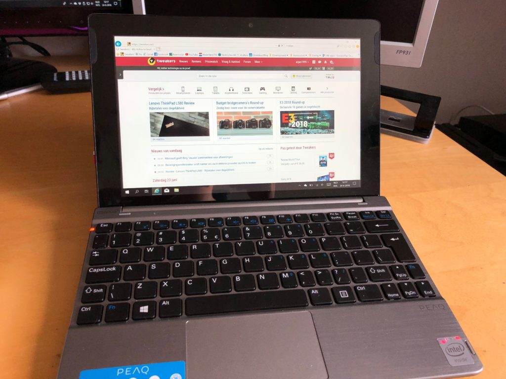

## Peaq PMM C1010 Drivers

Op deze site kun je de drivers voor de Peaq PMM C1010 kosteloos downloaden. Handig, wanneer je bijvoorbeeld Windows opnieuw wilt installeren. Of wanneer er na een update van Windows iets het niet meer doet.

*Peaq PMM C1010*

Hieronder staan de links naar de installatiebestanden van de drivers. Deze kun je direct vanaf deze site downloaden (originele links van Peaq zijn er niet meer). Vervolgens moet je ze alleen nog even installeren. Hoe? Dat lees je verderop.

**Download de drivers**

Chipset: [Download](url)

Een basisdriver waarmee o.a. de helderheid van het scherm geregeld kan worden. Installatie via Setup (2x)

Wi-Fi: [Download](url)

Drivers voor draadloos netwerk. Installatie via Setup. Meestal zijn deze al vanzelf geïnstalleerd en heb je deze dus niet nodig.

Bluetooth: [Download](url)

Drivers voor de Bluetooth. Installatie via Setup.
Meestal zijn deze al vanzelf geïnstalleerd en heb je deze dus niet nodig.

Realtek: [Download](url)

Software voor het regelen van het geluid. Installatie via Apparaatbeheer

Audio: [Download](url)

Drivers voor de geluidskaart. Installatie via Apparaatbeheer

Dolby: [Download](url)

Drivers voor Dolby Digital-geluidseffecten. Installatie via Setup (1) en Batchbestand (2)

Camera’s: [Download](url)

Drivers voor de camera’s van de 2-in-1. Installatie via Batchbestand of Apparaatbeheer

Geheugenkaartlezer: [Download](url)

Drivers voor de geheugenkaartlezers (zowel tablet als dock). Installatie via Setup.

G-Sensor: [Download](url)

Driver voor het automatisch draaien van het scherm bij het kantelen van de tablet. Installatie via autorun-bestand.

Dolby On-Screen Display: [Download](url)

Driver voor wisselen van Dolby-stand bij drukken op het knopje aan de zijkant van het apparaat (toont dan een pop-up). Installatie via Setup

Trackpad: [Download](url)

Driver voor het muispad / trackpad. Installatie via Setup

Trackpad – alternatief: [Download](url)

Gebruik deze wanneer de eerste trackpad-driver niet werkt. Installatie via Setup.

Continuum Mode: [Download](url)

Driver voor automatisch wisselen tussen tablet en laptopmodus van Windows. Uniek op deze website! Vereist aangepaste installatie (zie hieronder).!

**Installeren van de drivers**

Hoe je de drivers moet installeren, verschilt per driver. Er zijn ruwweg drie categorieën drivers, waarvoor de instructies hieronder staan. Het kan wel zo zijn dat de naamgeving van de configuratie-schermen net iets anders is. Deze wil per Windows 10-versie nog wel eens verschillen. De drie types zijn:

- Installatie via setup
- Installatie via batchbestand
- Installatie via apparaatbeheer.

Setup-wizard: De drivers waarbij “Installatie via Setup” staat, kun je installeren door ze uit te pakken en dan op setup.exe te klikken. De mappenstructuur wijst erop in welke volgorde je eventuele sub-onderdelen moet installeren.

Batchbestand: De drivers waarbij “Installatie via batchbestand” staat, kun je installeren door dubbel op het batchbestand te klikken.

Apparaatbeheer: De drivers waarbij “Installatie via Apparaatbeheer” staat, kun je als volgt installeren:

- Open Apparaatbeheer (rechts-klikken op het Start-icoon)
- Ga naar het apparaat wat met een geel uitroepteken staat (vb geluid: High definition audio codec staat geel).
- Klik hier rechts op en kies “Stuurprogramma bijwerken”
- Selecteer in de wizard “Op mijn computer naar een stuurprogramma zoeken”
- Kies vervolgens “Ik wil kiezen uit een lijst met stuurprogramma’s op mijn computer
- Kies “Bladeren” en ga naar de gedownloade map
- Selecteer het bestand (inf-bestand) wat als enige wordt getoond.
- De installatie wijst zichzelf

Installatie van de Continuum Mode drivers (uitzondering):

De continuum mode drivers moet je in `c:\program files` zetten, waardoor deze in de map `C:\Program Files\OEM\ContinuumMode` komen te staan. Dit kan door ze met de Verkenner te kopiëren.
Vervolgens moet je een snelkoppeling in de map “Opstarten” van het startmenu zetten
Deze moet wijzen naar: `C:\Program Files\OEM\ContinuumMode\APPServ.exe`

Ik hoop dat deze site je heeft geholpen om jouw Peaq C1010 weer werkend te krijgen! 

~Arjan
